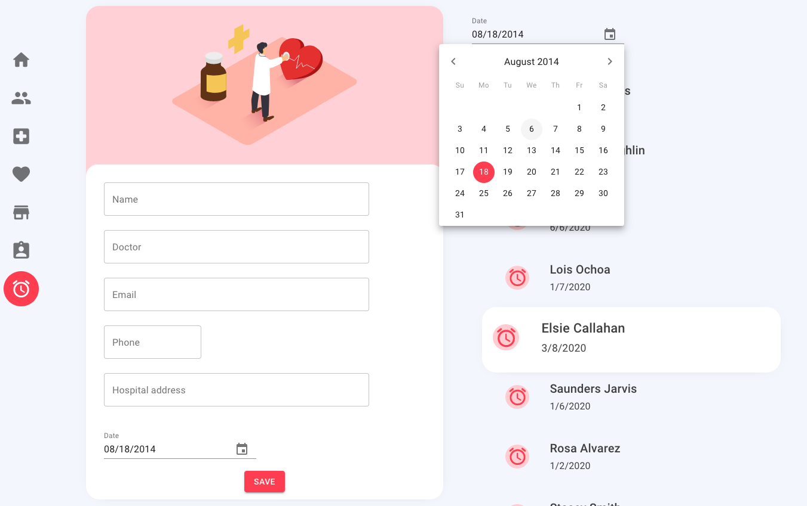

## Description

This is a **React** app that shows an approach to manage multiple resources using a generic view. Also using **Json Server** Mock api. For the client UI components i am using **MaterialUI** framework. 

## Screenshots



## Run Project

#### Api
```
npm run start-json-server
```

#### Client
```
npm start
```

## Show your support

Give a ⭐️  if this project helped you!
***